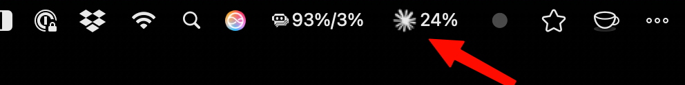
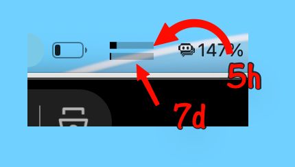

# Claude Code usage and rate monitoring — SwiftBar/xbar Plugin

A SwiftBar / xbar plugin that displays Claude Code rate limit utilization in the macOS menu bar, polling every 5 minutes. 

## Background

This script was *heavily* inspired on [ClaudeMeter](https://github.com/puq-ai/claude-meter) and [Claude Usage Bar](https://github.com/Blimp-Labs/claude-usage-bar?tab=readme-ov-file) (Swift MacOS apps). It borrows the structure from [`poe-balance`](https://github.com/rsnemmen/poe-balance). The result is something you can drop into your SwiftBar plugins folder and run immediately, without any build step.

Two display modes for usage:

1. Percentage
2. Progress bars 5h/7d




## Requirements

- macOS 12.3 or later
- [SwiftBar](https://github.com/swiftbar/SwiftBar) or [xbar](https://xbarapp.com)
- Claude Code CLI installed and signed in (credentials stored in Keychain automatically)
- `curl` and `python3` (both ship with macOS)

## Installation

1. Install SwiftBar (if you haven't already):

        brew install swiftbar

2. Copy the script to your SwiftBar plugins folder:

        cp claude_code.5m.sh ~/path/to/swiftbar/plugins/

3. Make it executable:

        chmod +x ~/path/to/swiftbar/plugins/claude_code.5m.sh

4. Click **Refresh All** in SwiftBar or wait for the next poll cycle.

No API key setup is needed. The script reads the OAuth token that Claude Code already stores in your macOS Keychain under `"Claude Code-credentials"`.


## Output

### Menu bar title

By default (`VAR_SHOW_BARS=true`), the title is a compact dual progress bar icon: the top bar represents the 5-hour window and the bottom bar represents the 7-day window. No percentage text is shown — just the bars.

When `VAR_SHOW_BARS=false`, the title falls back to the static Claude logo with a percentage:

```
45%
```

With `VAR_SHOW_7D=true` (and `VAR_SHOW_BARS=false`), both windows appear as text:

```
45%/23%
```

Color coding (when `VAR_COLORS=true`, applies to text title only):

| Utilization | Color |
|---|---|
| < 75% | default (no color) |
| ≥ 75% | yellow (`#FFD700`) |
| ≥ 90% | red (`#FF0000`) |

When both windows are shown, the title uses the more urgent color of the two.

### Dropdown

The dropdown shows the 5-hour and 7-day windows.

```
5h window
5h: 45% ████████░░░░░░░░░░░░
Resets in: 2h 30m
---
7d window
7d: 23% ████░░░░░░░░░░░░░░░░
Resets in: 4d 2h
---
Refresh
```

## Misc

### Configuration

Edit the `xbar.var` lines at the top of the script, or use SwiftBar's built-in variable editor (right-click the menu bar item → **Preferences**).

| Variable | Default | Description |
|---|---|---|
| `VAR_SHOW_BARS` | `true` | Show a dynamic dual progress bar icon (5h top, 7d bottom) instead of the Claude logo |
| `VAR_SHOW_7D` | `false` | Also show the 7-day window in the title as text (`45%/23%`); only applies when `VAR_SHOW_BARS=false` |
| `VAR_COLORS` | `true` | Color-code the title at warning and critical thresholds; only applies when `VAR_SHOW_BARS=false` |
| `VAR_SHOW_RESET` | `true` | Show time-until-reset for each window in the dropdown |

### Error states

| Condition | Menu bar display |
|---|---|
| Claude Code not signed in | `⚠️ No Credentials` |
| OAuth token expired | `⚠️ Token Expired` |
| Network or API error | `⚠️ API Error (NNN)` |
| Unexpected API response | `⚠️ Parse Error` |

If credentials are missing, sign in to Claude Code (`claude login`) and the script will pick them up on the next poll.

### How it works

1. Reads the Claude Code OAuth token from the macOS Keychain using the `security` CLI — the same approach used in ClaudeMeter's `KeychainService.swift` — which avoids triggering a Keychain password prompt.
2. Calls `GET https://api.anthropic.com/api/oauth/usage` with the bearer token and the `anthropic-beta: oauth-2025-04-20` header.
3. Parses the three rate-limit windows (`five_hour`, `seven_day`, `seven_day_opus`) from the JSON response using an inline `python3` snippet.
4. Formats utilization percentages, ASCII progress bars, and countdown timers, then prints SwiftBar-formatted output.

All JSON parsing and date arithmetic is handled by `python3` (stdlib only). No `jq`, no `bc`, no third-party packages.

### Polling interval

The `5m` in the filename tells SwiftBar to run the script every 5 minutes. To change the interval, rename the file — for example, `claude_code.1m.sh` for once per minute or `claude_code.15m.sh` for every 15 minutes.

### Inspiration for this project

- **[ClaudeMeter](https://github.com/puq-ai/claude-meter)** — the full native macOS app this script lives alongside: adaptive polling, circuit breaker, notifications, settings UI, and more, all in Swift.
- **[poe_balance](https://github.com/rsnemmen/poe-balance)** — the SwiftBar plugin for Poe API credits that served as the structural template for this script.

## More SwiftBar plugins by the author

Small, glanceable menu bar utilities that stay out of the way until you need them:

- **[claude_code](https://github.com/rsnemmen/claude-code-xbar)** — Claude Code usage limits (5h, 7d windows) at a glance.
- **[copilot-usage-tracker](https://github.com/rsnemmen/copilot-usage-tracker)** — GitHub Copilot premium request usage and monthly pacing.
- **[poe_balance](https://github.com/rsnemmen/poe-balance-xbar)** — Poe API balance, percentage, and spending pace vs. the billing cycle.
- **[weather](https://github.com/rsnemmen/weather-bar)** — Current conditions, temperature, humidity, and wind — no API key required.